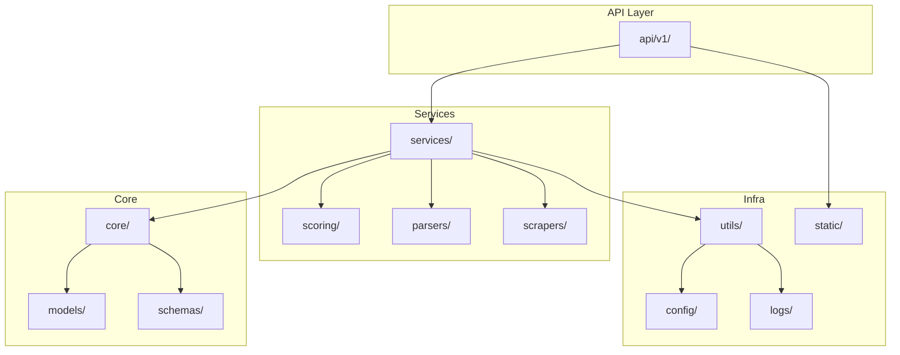

# Good Eats

**AI-powered meal recommendation engine for personalized, macro-matched, and location-aware restaurant meal discovery.**

## 🚀 Project Purpose
Good Eats is a modular, GPS-powered, AI-enhanced meal recommendation engine that matches nearby restaurant meals to users' macro targets, fitness goals, dietary preferences, and flavor profiles. Designed for real-time use, B2B integrations, and high personalization.

## 🏗️ Project Structure (Clean Architecture)
```
api/v1/         # Versioned API routes and handlers
services/       # Core service logic (meal discovery, scoring, etc.)
core/           # Business rules, goal matching, auth, rate limiting
schemas/        # Pydantic models for requests/responses
models/         # Internal data representations
scoring/        # Modular scoring logic and ranking rules
parsers/        # GPT/rule-based menu parsing
scrapers/       # Scraping logic and fallback hierarchy
utils/          # Common utilities (caching, logging, env)
config/         # Environment configs, YAMLs
static/         # Optional HTML/JS frontend fallback
logs/           # Structured logs (daily rotation)
```

## 📦 Dependencies
- fastapi==0.104.1, uvicorn[standard]==0.24.0
- pydantic==2.5.0
- httpx==0.25.2
- openai==1.3.7
- playwright==1.40.0
- redis==5.0.1, aioredis==2.0.1
- pandas==2.1.4, numpy==1.25.2
- fuzzywuzzy[speedup]==0.18.0
- python-dotenv==1.0.0
- structlog==23.1.0 or loguru==0.7.0
- pytest==7.4.3, pytest-asyncio==0.21.1
- rich or typer (optional CLI/debug)

## 🌎 Environment Setup
1. Copy `.env.template` to `.env` and fill in secrets:
   ```sh
   cp .env.template .env
   # Edit .env with your keys
   ```
2. Create and activate a virtual environment:
   ```sh
   python -m venv venv
   source venv/bin/activate  # or venv\Scripts\activate on Windows
   ```
3. Install dependencies:
   ```sh
   pip install -r requirements.txt
   ```

## 🛠️ Dev & Test Commands
- **Run dev server:**
  ```sh
  uvicorn main:create_app --factory --reload
  ```
- **Run tests:**
  ```sh
  pytest
  ```

## 📘 API Docs
- Swagger/OpenAPI: `/docs`
- Redoc: `/redoc`
- Internal prompt docs: `/docs/internal`

## 🖼️ System Diagram


---

**For prompt design and parsing examples, see `/docs/internal`.** 