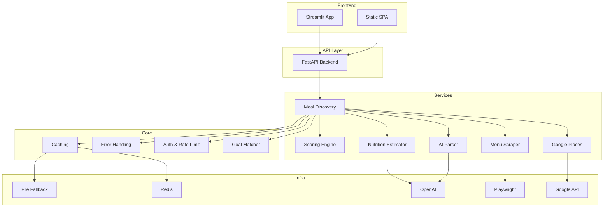

# Architecture Overview

## System Diagram


## Folder Structure
```
api/v1/         # Versioned API routes
services/       # Core service logic
core/           # Business rules, auth, rate limiting
schemas/        # Pydantic models
models/         # Internal data representations
scoring/        # Scoring logic
parsers/        # Menu parsing (AI, fallback)
scrapers/       # Scraping logic
utils/          # Utilities (logging, env)
config/         # Configs, YAMLs
static/         # SPA frontend
logs/           # Logs
assets/         # Images/icons
scripts/        # Dev/debug tools
docs/           # Documentation
``` 